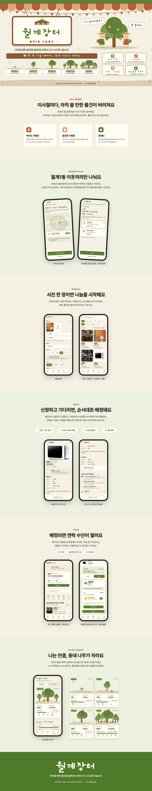

# 🧺 월계장터

<div align="center">

**이사 가는 이웃의 물건이, 이사 오는 이웃의 살림이 되도록.**
<br/>
**버리기엔 아깝고 팔기엔 번거로운 가구·가전, 월계장터에서 동네 이웃에게 나눠요.**

<br/>

[🌐 서비스 바로가기](https://www.wolgyesangdan.site)

</div>



---

## 📌 서비스 소개

월계장터는 **월계동 주민끼리 쓰지 않는 생활 물품을 무료로 나누는 동네 자원순환 웹앱**이에요.

자취생이나 이사를 앞둔 주민은 아직 쓸 만한 침대·책상·전자레인지 같은 물건을 이사일까지 처분하지 못해 버리는 경우가 많아요. 중고거래는 판매가 목적이라 빨리 넘기기 어렵고, 학교·기관이 여는 수거 캠페인은 기간이 맞는 사람만 이용할 수 있어요.

월계장터는 **상시 직거래**와 **캠페인 기간의 거점 거래**를 함께 제공해서, 이사 날짜와 상관없이 물건이 동네 안에서 다시 쓰이도록 연결해요.

### 주요 기능

| 기능 | 설명 |
| --- | --- |
| 🏠 **동네 인증** | 카카오 로그인 후 GPS로 월계동 주민인지 확인해요. 인증한 이웃만 물품을 나누고 신청할 수 있어요. |
| 📦 **물품 등록** | 사진·카테고리·상태·전달 가능 기간을 입력하고, 직거래 / 캠페인 거점 / 둘 다 중에서 거래 방식을 골라요. |
| 🙋 **신청과 자동 배정** | 선착순 경쟁 없이 신청 기간 동안 신청을 받고, 마감되면 서버가 받을 사람을 자동으로 정해요. |
| 🎓 **우선배정** | 신입생·저소득층 서류를 제출해 관리자 승인을 받으면 배정 때 가산점을 받아요. |
| 🔁 **노쇼 승계** | 받을 사람이 기한 안에 확인하지 않으면 다음 대기자에게 자동으로 넘어가요. |
| 🤝 **직거래 / 거점 거래** | 직거래는 카카오톡 오픈채팅으로 연락하고, 캠페인 기간에는 거점에 맡기고 찾아가요. |
| 🌳 **탄소절감 리포트** | 동네에서 나눈 물건이 줄인 탄소량을 소나무 그루 수로 보여주고, 누적량에 따라 동네 나무가 자라요. |
| 🛠️ **관리자 웹** | 캠페인 운영, 우선배정 서류 심사, 거점 입고·수령 처리, 물품 숨김을 관리해요. |

---

## 👥 TEAM 월계상단

<table width="100%">
  <tr>
    <td align="center" width="25%">
      
      <br/>
      <a href="https://github.com/kwonminsooo"><strong>권민수</strong></a>
      <br/>
      기획 · 디자인 · BE · FE
    </td>
    <td align="center" width="25%">
      
      <br/>
      <a href="https://github.com/kim-ch2"><strong>김창현</strong></a>
      <br/>
      BE · FE · 배포
    </td>
    <td align="center" width="25%">
      
      <br/>
      <a href="https://github.com/lym0309"><strong>이용민</strong></a>
      <br/>
      디자인 · 인프라 · BE · FE
    </td>
    <td align="center" width="25%">
      
      <br/>
      <a href="https://github.com/woo-sb"><strong>우승범</strong></a>
      <br/>
      BE · FE · 배포
    </td>
  </tr>
</table>

## 🛠️ 기술 스택

<table width="100%">
  <tr><th width="20%">카테고리</th><th>기술 스택</th></tr>
  <tr><td><b>Frontend</b></td><td>

    

</td></tr>
  <tr><td><b>Backend</b></td><td>

    

</td></tr>
  <tr><td><b>Database</b></td><td>


</td></tr>
  <tr><td><b>Auth</b></td><td>

 

</td></tr>
  <tr><td><b>Infra</b></td><td>

    

</td></tr>
  <tr><td><b>CI</b></td><td>


</td></tr>
  <tr><td><b>Cooperation</b></td><td>

   

</td></tr>
</table>

---

## 🏗️ 시스템 구성

```
                 ┌──────────────────────────────┐
  사용자 ───────▶ │  www.wolgyesangdan.site      │  회원용 웹앱 (Vercel)
                 └──────────────┬───────────────┘
  관리자 ───────▶ ┌──────────────┴───────────────┐
                 │  admin.wolgyesangdan.site    │  관리자 웹 (Vercel)
                 └──────────────┬───────────────┘
                                │ HTTPS
                 ┌──────────────▼───────────────┐
                 │  api.wolgyesangdan.site      │  Nginx → Spring Boot (AWS EC2)
                 └──────┬───────────────┬───────┘
                        │               │
                 ┌──────▼─────┐   ┌─────▼──────┐
                 │   MySQL    │   │ Amazon S3  │  물품 사진 · 인증 서류
                 └────────────┘   └────────────┘
```

- 물품 사진과 인증 서류는 서버를 거치지 않고, 서버가 발급한 **presigned URL**로 브라우저에서 S3에 바로 올려요.
- 신청 마감·배정·노쇼 승계는 서버의 **스케줄러**가 1분마다 확인해서 처리해요.

---

## 📁 폴더 구조

```
19_Wolgyesangdan
├── backend/                 # Spring Boot API 서버
├── frontend/                # 회원용 웹앱 (React + Vite)
├── admin/                   # 관리자 웹 (React + Vite)
└── .github/                 # 이슈·PR 템플릿, CI 워크플로
```

### Backend

도메인(기능)별로 폴더를 나누고, 각 도메인 안에서 `controller / dto / entity / repository / service / exception`으로 한 번 더 나눠요. 도메인에 속하지 않는 공통 코드는 `global`에 모아요.

```
backend/src/main/java/com/Wolgyesangdan/backend/
├── domain/
│   ├── auth/            # 카카오 로그인, 관리자 로그인, JWT 발급·재발급
│   ├── user/            # 회원, 연락 수단(오픈채팅), 내 활동
│   ├── verification/    # 동네 인증, 우선배정 서류 인증·심사
│   ├── campaign/        # 자원순환 캠페인, 거점
│   ├── item/            # 물품, 사진, 거래 방식, 카테고리별 탄소 절감량
│   ├── application/     # 물품 신청, 대기열
│   ├── reservation/     # 배정, 전달·수령, 거점 입고
│   ├── carbonreport/    # 탄소절감 리포트 집계
│   ├── inquiry/         # 1:1 문의
│   └── dashboard/       # 관리자 대시보드
└── global/
    ├── config/          # Security, CORS, S3, 스케줄러 설정
    ├── security/        # JWT 인증 필터
    ├── exception/       # 공통 에러 코드, GlobalExceptionHandler
    ├── dto/             # 공통 응답 형식
    └── entity/          # BaseTimeEntity
```

### Frontend / Admin

```
frontend/src/
├── pages/               # 화면 단위 컴포넌트
├── components/          # 공통 UI (버튼, 다이얼로그, 카드 등)
├── layouts/             # 하단 탭·상세 화면 레이아웃
├── api/                 # API 호출 함수
├── hooks/               # 로그인 확인, 캠페인, 동네 위치 등
├── contexts/            # 연락 수단·할 일 상태
├── lib/                 # 토큰 저장, 카카오 SDK, S3 업로드 등
└── types/               # API 응답 타입
```

`admin/src`도 같은 구조를 따라요.

---

## 📚 문서

| 문서 | 링크 |
| --- | --- |
| 요구사항 명세서 | [Notion](https://guiltless-goldfish-eb9.notion.site/9f4a1de36a0a82b1964181a580ee4e0f?source=copy_link) |
| API 명세서 | [Notion](https://guiltless-goldfish-eb9.notion.site/API-eeba1de36a0a82eba25401121ecbc87e?source=copy_link) |
| ERD | [Notion](https://guiltless-goldfish-eb9.notion.site/ERD-657a1de36a0a837baa1001f895f74753?source=copy_link) |

---

## 🌿 GitHub 전략

### 브랜치

| 브랜치 | 역할 |
| --- | --- |
| `main` | 최종 제출 브랜치 |
| `dev` | 기능 브랜치가 모이는 통합 브랜치. 모든 PR은 여기로 보내고, 배포도 이 브랜치 기준이에요 |

기능 브랜치는 `type/작업-내용` 형식으로 만들어요.

```
feature/item-list-filter
feature/assignment-scheduler
fix/register-hub-option
chore/prod-profile
```

### 이슈 & PR

- 작업은 **이슈를 먼저 만들고** 시작해요. 이슈 템플릿은 `기능` / `버그` 두 가지예요.
- PR은 `.github/PULL_REQUEST_TEMPLATE.md` 형식(체크리스트 / 작업 내용 / 관련 이슈 / 참고 사항)을 따르고, `close #이슈번호`로 이슈와 연결해요.
- **PR 제목:** `[FEAT] 설명`, `[FIX] 설명`, `[CHORE] 설명`
- **라벨:** 작업 종류(`✨Feature` / `🐞BugFix` / `⚙️Chore` / `📄Docs`) + 작성자(`🐶민수` / `🐹창현` / `🐳용민` / `🐱승범`)

### 커밋 메시지

```
feat: 물품 목록 조회 API 구현 (#41)
fix: 거점 거래를 할 수 없을 때는 등록 화면에서 캠페인 거점 선택지를 막기 (#268)
refactor: 리뷰 반영 — 집계 projection을 reservation 도메인으로 이동
chore: 관리자 웹 Vercel 배포 설정 추가
```


## 📄 오픈소스 라이선스 및 출처

월계장터는 아래 오픈소스와 외부 자료를 사용했어요. 각 라이선스 조건을 지키며 사용했고, 원본 라이선스 전문은 각 프로젝트 저장소에서 확인할 수 있어요.

### 라이브러리 · 프레임워크

| 이름 | 사용한 곳 | 라이선스 |
| --- | --- | --- |
| [React](https://github.com/facebook/react) | frontend, admin | MIT |
| [React Router](https://github.com/remix-run/react-router) | frontend, admin | MIT |
| [Vite](https://github.com/vitejs/vite) | frontend, admin | MIT |
| [TypeScript](https://github.com/microsoft/TypeScript) | frontend, admin | Apache-2.0 |
| [Tailwind CSS](https://github.com/tailwindlabs/tailwindcss) | frontend, admin | MIT |
| [oxlint](https://github.com/oxc-project/oxc) | frontend, admin | MIT |
| [Spring Boot](https://github.com/spring-projects/spring-boot) · [Spring Security](https://github.com/spring-projects/spring-security) · [Spring Data JPA](https://github.com/spring-projects/spring-data-jpa) | backend | Apache-2.0 |
| [Hibernate ORM](https://github.com/hibernate/hibernate-orm) | backend | Apache-2.0 |
| [JJWT](https://github.com/jwtk/jjwt) | backend | Apache-2.0 |
| [AWS SDK for Java v2](https://github.com/aws/aws-sdk-java-v2) | backend | Apache-2.0 |
| [Lombok](https://github.com/projectlombok/lombok) | backend | MIT |
| [MySQL Connector/J](https://github.com/mysql/mysql-connector-j) | backend | GPL-2.0 with Universal FOSS Exception |
| [MySQL](https://www.mysql.com/) (Docker 이미지) | 로컬 DB | GPL-2.0 |
| [Gradle](https://github.com/gradle/gradle) | backend 빌드 | Apache-2.0 |
| [GitHub Actions](https://github.com/actions) (`checkout`, `setup-java`, `setup-node`, `upload-artifact`, `gradle/actions`) | CI | MIT |

### 폰트 · 아이콘

| 이름 | 사용한 곳 | 라이선스 |
| --- | --- | --- |
| [Pretendard](https://github.com/orioncactus/pretendard) | 기본 글꼴 | SIL OFL 1.1 |
| [Gaegu](https://fonts.google.com/specimen/Gaegu) | 손글씨 제목 | SIL OFL 1.1 |
| [Material Symbols](https://github.com/google/material-design-icons) | 아이콘 | Apache-2.0 |

### 외부 서비스

| 이름 | 사용한 곳 | 비고 |
| --- | --- | --- |
| [Kakao JavaScript SDK](https://developers.kakao.com/docs/latest/ko/javascript/getting-started) | 카카오 로그인 | Kakao Developers 이용약관에 따라 사용 |

### 탄소절감량 산정 자료

물품 카테고리별 탄소 절감량과 소나무 환산값은 아래 공개 자료를 바탕으로 계산했어요.

| 자료 | 사용한 값 |
| --- | --- |
| WRAP (2012), *Benefits of Reuse — Case Study: Domestic Furniture* | 가구 재사용 시 절감량 (소파·식탁 등) |
| UK DESNZ (2024), *Greenhouse Gas Reporting: Conversion Factors* | 소형 가전·금속·플라스틱 신제품 생산 배출계수 (kg CO₂e/t) |
| 국립산림과학원, 주요 산림수종의 표준 탄소흡수량 | 30년생 소나무 1그루 연간 흡수량 6.6kg CO₂e |


---

## ⚖️ License

이 프로젝트는 [MIT License](./LICENSE)를 따릅니다.

```
MIT License

Copyright (c) 2026 월계상단 (2026 KW Hackathon Team 19)
```
